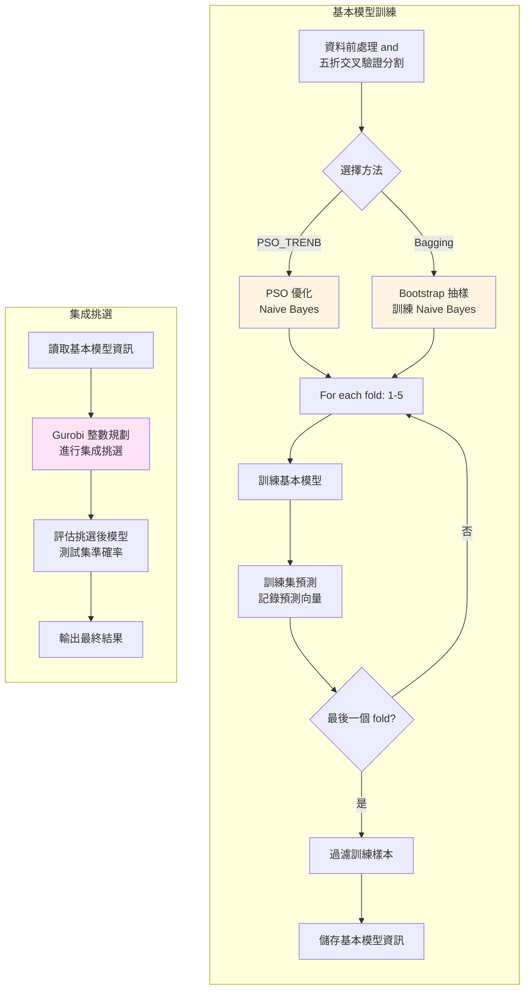

## Overview

本專案實作了一個完整的多類別分類系統，結合粒子群優化（PSO）、Bagging 集成學習、資料過濾與模型選擇優化等技術。系統使用 Naive Bayes 作為基礎分類器，透過多種集成策略提升分類效能，並採用 5 折交叉驗證進行評估。

## Core
- **PSO-TRENB**：使用粒子群優化演算法訓練隨機生成之基本模型。
- **Bagging**：透過 Bootstrap 抽樣建立多個基本模型
- **資料過濾**：過濾訓練樣本以減少限制式數量。
- **集成挑選**：使用 Gurobi 進行整數規劃，從基本模型中選出最佳子集
---

## Project Architecture
```
┌────────────────────────────────────────────────────────────┐
│                      資料前處理                              │
│        data_preprocessing.py: 等寬離散化                     │
└──────────────────────┬─────────────────────────────────────┘
                       │
                       ▼
┌─────────────────────────────────────────────────────────────┐
│                       模型訓練層                              │
│                                                             │
│   ┌──────────────┐  ┌──────────────┐  ┌──────────────┐      │
│   │ PSO_TRENB.py │  │  bagging.py  │  │PSO_Bagging.py│      │
│   │              │  │              │  │              │      │
│   │   PSO 優化    │  │  Bootstrap   │  │   混合方法    │      │
│   │  Naive Bayes │  │ Naive Bayes  │  │              │      │
│   └──────┬───────┘  └──────┬───────┘  └──────┬───────┘      │
│          │                 │                 │              │
│          └────────────┬────┴────┬────────────┘              │
│                       │         │                           │
│                       ▼         ▼                           │
│               ┌─────────────────────┐                       │
│               │     資料過濾層        │                       │
│               │  data_filtering.py  │                       │
│               └──────────┬──────────┘                       │
└──────────────────────────┼──────────────────────────────────┘
                           │
                           ▼
┌─────────────────────────────────────────────────────────────┐
│                     集成挑選層                                │
│            optimize.py: Gurobi 整數規劃求解                   │
└─────────────────────────────────────────────────────────────┘
```

### 專案結構
```
multiclass_code/
├── config.py                    # 核心配置檔案
├── run.py                       # 執行腳本
├── data_preprocessing.py
├── 模型訓練
│   ├── PSO_TRENB.py          
│   ├── bagging.py             
│   └── PSO_Bagging.py         
├── 資料過濾
│   ├── data_filtering.py       
│   └── check_data_filter.py     # 過濾結果驗證
├── optimize.py            
├── datasets/                   
│   ├── 原始資料集/
│   └── 離散化資料集/
├── temp_models/                 # 訓練好的模型儲存
├── training_accuracies/         # 訓練準確率記錄
├── training_pred_vec/           # 訓練集預測向量
├── data_filter_reserved/        # 資料過濾保留樣本
├── data_filter_res/             # 資料過濾統計結果
├── selection_result/            # 模型選擇結果與集成挑選後測試集準確率
├── accuracy_result/             # 初始準確率
├── data_filter_var.xlsx         
├── pyproject.toml 
├── requirements.txt
└── README.md                   
```
### 核心模組說明

* `config.py`
    * 所有模型訓練與實驗過程的參數，統一在此程式內進行修改。
* `data_preprocessing.py`
    * 對所有資料及進行等寬離散化。
* `PSO_TRENB.py`
    * 先使用隨機生成產生模型，再用粒子群優化演算法迭代修正此模型。
    * 支援多種適應度函數（Micro、Macro Average、Penalty）。
* `bagging.py`
    * Bootstrap Aggregating 對資料集抽樣以建構多個基本模型。
* `PSO_Bagging.py`
    * 混合 PSO 與 Bagging 方法訓練得到的基本模型。
* `data_filtering.py`
    * 對每個模型訓練方法進行資料過濾，以減少後續最佳化模型所需的限制式數量。
* `optimize.py`
    * 建構最佳化集成挑選模型，設計目標函式與限制式，並執行整數規劃。
    * 使用 Gurobi 套件進行。
* `check_data_filter.py`
    * 驗證資料過濾結果的正確性 (所有過濾與保留樣本，是否正確依照過濾條件進行篩選)。


## 實驗流程


---
### 內部細節說明
#### 1. 資料前處理

* `transfer_class()` 裡會將類別值 (不論數值型或文字型類別) 都重新編碼，使其類別值必從 0 開始，後續操作僅需依靠索引判斷類別即可。
#### 2. 多類別預測結果
為了配合後續資料過濾機制，需要知道樣本的所有類別得票數，會將基本模型對於訓練樣本的預測向量化編碼。
* 將基本模型的預測輸出轉換為 **One-Hot Encoding**。
* 向量元素為二元變數 $\{0, 1\}$，若模型預測類別為 $k$，則向量第 $k$ 位索引值為 1，其餘為 0。
#### 3. 資料過濾
資料過濾表儲存在 `training_pred_vector/`
```
[
 [1,0,0,0],[0,0,0,1],[0,1,0,0],
 [1,0,0,0],[0,0,0,1],[0,1,0,0],
 [1,0,0,0],[0,0,0,1],[0,1,0,0]
]
資料過濾表結構：(N, B, C)
- N: 訓練樣本數
- B: 基礎模型數（50）
- C: 類別數

每個元素 pred_vector[j][i][c] 表示：
  樣本 j 被模型 i 預測為類別 c 的結果（0 或 1）
```
過濾規則
```
Vyj = 樣本 j 的真實類別獲得的總票數
max_Vcf = 樣本 j 的錯誤類別中最大票數
---
保留樣本的條件 (三個條件都必須不成立)：
  條件 1: Vyj - (m - b) > max_Vcf  （真實類別票數足夠高）
  條件 2: Vyj < b / class_nums     （真實類別票數過低）
  條件 3: Vyj + (m - b) < max_Vcf  （錯誤類別票數過高）

其中：
  m = 基礎模型總數（50）
  b = 選擇模型數量（25）
  class_nums = 類別數
```


#### 4. PSO_TRENB 基本模型訓練
本實驗使用的演算法為簡易貝氏，模型參數皆為機率值，會先隨機產生機率，後續粒子群不斷優化機率參數，因此粒子的位置為所有機率值。
```
--- Algorithm: Random_Generation_Combined_with_PSO ---
1:  Initial particles with Random(Prior, Likelihood)
2:  Cal initial fitness for all particles
3:  Initial Random Velocities for all particles
4:  While iter < max_iter do:
5:      For each particle do:
            Update Velocity
            Update Position
        End For
6:      Cal fitness for updated particles
7:      Update Pbest
8:      Update Gbest
9:  End While
10: Output Best Particle (Gbest)
11: Generate Base Model from Best Particle
```
#### 5. 最佳化集成挑選模型
* 目標函數：
```
Maximize: Σ β[j]  for j in 保留樣本
```
* 限制式：
```
Σ x[i] = b                          （選擇固定數量模型）

For each 保留樣本 j:
    For each 錯誤類別:
        correct_votes = 真實類別得票數
        wrong_votes = 錯誤類別得票數
        // 要使得 β[j] 可以為 1 =>
        correct_votes - wrong_votes >= 1
```

使用 Gurobi 的 Indicator Constraint 處理條件限制。

#### 6. 資料集清單 (`DATASET_LIST`)

預設包含多個多類別資料集，可在 `config.py` 中修改。

---

## 使用方法

### 環境需求

- Python >= 3.13
- Gurobi 求解器與授權（用於 `optimize.py`）

### 安裝依賴

```bash
uv python install cpython-3.13  # 使用 uv 安裝 python
uv init -p 3.13                 # 在你的專案環境下建立虛擬環境

# 將套件需求同步到與 requirements.txt 一致
uv add -r requirements.txt
# 匯出你所有安裝過的套件
uv export --format requirements-txt > requirements.txt
```

### 運行
批次執行訓練步驟
```bash
uv run run.py      # 可在 run.py 內選擇執行的腳本
```
**注意**：如需執行最佳化模型選擇或資料前處理，請另外執行：
```bash
uv run data_preprocessing.py
uv run optimize.py
```
---
## 注意事項

1. **資料格式**：原始資料集必須包含名為 `class` 的目標變數欄位
2. **Gurobi 授權**：執行 `optimize.py` 需要有效的 Gurobi 授權
4. **記憶體需求**：處理大型資料集時可能需要較大記憶體
5. **執行時間**：PSO 優化與模型選擇可能需要較長時間（數小時）

